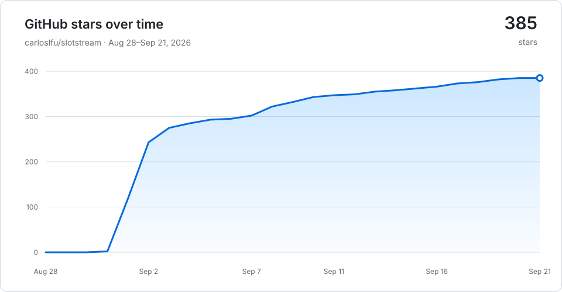

# slotstream

[](https://github.com/carloslfu/slotstream/actions/workflows/release.yml) [](https://github.com/carloslfu/slotstream/releases/latest) [](https://github.com/carloslfu/slotstream/stargazers)

Run **Qwen3.8-Flash-Next** on a Mac that can't hold it. The model is a
125B-parameter mixture-of-experts, 105 GB on disk at 4-bit; slotstream streams
it from SSD and runs it in whatever memory you give it. It's one Swift binary,
no Python. It speaks the Ollama and OpenAI chat APIs, so your existing tools
work unchanged.

The launch was [discussed on Hacker News](https://news.ycombinator.com/item?id=49524447) —
227 points and 114 comments. On 2026-09-01 it peaked at No. 1 on Show HN and
No. 8 on the front page.

| on a 48 GB M5 Pro | |
|---|---|
| Warm decode | ~12 tok/s |
| Engine start | ~2 s (only the 3.8 GB trunk loads) |
| Peak memory | 32 GB (auto-sized; you can cap it) |
| Weights on disk | 105 GB |

## Why this exists

I have a 48 GB MacBook Pro and wanted this model on it. The stock loader took
the machine into 48 GB of swap before the first token, and the fix was a
memory design rather than a faster kernel: keep the 3.8 GB trunk resident,
stream experts through a fixed pool of slots, size that pool to what the
machine really has, and give memory back when other apps want it. Every
number in this README ships with its measurement, including the experiments
that failed; [MEASUREMENTS.md](MEASUREMENTS.md#m07--the-naive-path-fails-why-slotstream-exists)
starts where this did.

## Will it run on my Mac?

You need Apple Silicon, macOS 14+, and ~110 GB of free disk. Disk bites
first: whatever your memory, a 512 GB Mac is the realistic minimum.

**Apple Silicon only, and not by accident.** The engine is MLX and Metal, and
the memory design assumes unified memory: experts are read from SSD straight
into memory the GPU already addresses, and the pool is sized against the one
memory the OS, your apps, and the GPU all share. A discrete card has two
separate budgets with a bus between them, so a Linux or Windows build would be
a second engine with a second cache tier, not a port. It isn't on the roadmap.
On another platform, or after a different model, start with llama.cpp in
[Related projects](#related-projects).

Auto-sizing never takes the whole machine. What each tier gets:

| your Mac | slotstream takes | warm decode |
|---|---|---|
| 8 GB | 8.1 GB, the floor | ~3 tok/s, and `doctor` warns it will page |
| 16 GB | 10 GB | ~4 tok/s |
| 24 GB | 16 GB | ~8 tok/s |
| 32 GB | 22 GB | ~9 tok/s |
| 48 GB and up | 33 GB (more buys nothing; see [Memory](#memory)) | ~12 tok/s |

These rows come straight from `slotstream doctor --sim-ram N`, so you can
reproduce them. Two are measured on real Macs; the rest are estimates from the
48 GB curve, and that curve has no term for how fast your SSD reads — which is
the one thing it has since been caught missing. A base-storage Mac mini M2
measured 1.41 tok/s against this table's ~4, on a disk that reads 1.5 GB/s
where the dev Mac reads 17.3. If you have one of these Macs,
[docs/HARDWARE.md](docs/HARDWARE.md) is a ten-minute procedure to measure it
and get your row into the table. The middle column
assumes nothing else is holding memory: with a browser open,
auto takes less and says so in the plan it prints at startup (see
[Memory](#memory)). Run `slotstream doctor` before downloading anything: it
prints your machine's plan and whether the disk can hold the weights.

## Install

```bash
curl -fsSL https://raw.githubusercontent.com/carloslfu/slotstream/main/install.sh | sh
```

Installs the latest release to `~/.slotstream/bin` and puts it on your PATH.
Re-run the same line to upgrade. To uninstall, `rm -rf ~/.slotstream` and
remove the `/usr/local/bin/slotstream` wrapper or the PATH line the installer
told you it added.

Releases are built by CI from the tagged commit with signed provenance, so you
can verify an asset instead of trusting the download:

```bash
gh attestation verify slotstream-arm64.tar.gz --repo carloslfu/slotstream
```

Or build `main` yourself. Command Line Tools are enough, no Xcode needed:

```bash
git clone https://github.com/carloslfu/slotstream && cd slotstream
make build
```

### The 105 GB download

The binary is small; the weights are not: 105.3 GB across 25 files, one time
(the last, the 1.5 GB draft head, is optional: a source without it leaves the
pull green and speculative decode off).
`serve` and `run` offer the download on first use, or `slotstream pull` does
it directly. Before transferring anything it prints the size, the destination,
and your free disk, waits for a yes, and refuses outright if the disk can't
hold it.

Your link sets the pace. `pull` opens eight TCP connections; a full install
from a 1 Gbit/s datacenter link measured 112 MB/s, 16 minutes for the whole
thing, which is the port. At 100 Mbps plan on ~2 h 20; at 25 Mbps, ~9 h. One
connection alone is bounded by the round trip to Hugging Face — about 70 MB/s
from a datacenter, 25 to 40 from a home link 100 ms away — which is why the
count matters and why `pull` prints how many it is actually using. (Through
0.2.0 it ran on one connection whatever the flag said; see the changelog.)

Interrupting is safe: `pull` picks up where it stopped, redoing at most the
few chunks that were in flight, and all 25 files are checked against sha256
hashes compiled into the binary, so a truncated or corrupted download can't
reach the engine. The files come from a mirror of the pinned revision, with
the original repo as fallback; the hashes are the same either way.
`pull --verify` re-hashes an existing copy any time (8 s here).

## Use it

First taste, no server:

```bash
slotstream run --prompt "why is the sky blue?"
```

For everything else, `serve` listens on port 11434 and implements the
chat/generate subset used by Ollama clients and OpenAI SDKs:

```bash
slotstream serve
```

```bash
curl localhost:11434/api/chat -d '{
  "model": "qwen3.8-flash-next:4bit",
  "messages": [{"role": "user", "content": "hello"}]
}'
```

Open WebUI and the OpenAI SDKs are tested against this subset (the Ollama
CLI is not there yet; see [Status](#status-and-limits)). Streaming, CORS, and
the usual sampling options all work. What these two dialects do not support
(tools, JSON-schema output, logprobs) returns a clear 400 instead of being
silently ignored. Every endpoint, field, default, and error is in
[docs/API.md](docs/API.md).

### Pictures

The model reads images, and every dialect takes them: Ollama's `images`
array on `/api/chat` and `/api/generate`, OpenAI `image_url` parts,
AI-SDK `file` parts on the fx gateway, and `--image` on the command line.

```bash
slotstream run --image cat.jpg --prompt "what breed is this?"
```

A picture becomes one token per 32x32 pixels of its resized self, at most
2,304 tokens each, out of the same context as the text. The vision tower is
0.9 GB and loads the first time an image arrives — on top of the memory plan
`serve` printed, and refused with a 400 if the machine cannot spare it at that
moment, so the announced peak stays true for text-only runs. `serve --vision
off` declines images outright.

Only inline bytes are accepted: a `data:` URL or bare base64, never an
`http://` or `file://` URL. The server does not fetch what a request points
it at.

A follow-up turn about the same picture re-uses the state built for it, so the
tower runs once per image rather than once per turn — measured 15.4 s for the
first turn and 1.8 s for the second, on the same conversation. Two different
pictures are told apart by a digest of their bytes, never by their token ids,
which are identical placeholders.

### Coding agents

The same server also speaks the Vercel AI SDK Language Model Specification v4
over AI Gateway protocol 0.0.1, which is what [fx](https://fx.sh) talks. Tool
calling is native there: the model emits calls in its own format and slotstream
parses them as they stream, typing each argument against the tool's schema. fx
has no custom-provider setting, but its gateway client accepts a loopback
override, so pointing it at a local model needs no fork:

```bash
FX_GATEWAY_BASE_URL=http://127.0.0.1:11434 \
FX_GATEWAY_CHAT_URL=http://127.0.0.1:11434/v3/ai/language-model \
AI_GATEWAY_API_KEY=local-dummy-key fx models
```

Use a throwaway `$HOME` so your normal fx profile is untouched, and read
[docs/FX.md](docs/FX.md) first — it has the wrapper script, and it is honest
about what does not work (fx's `auto` permission mode and its session
compaction, both for deadline reasons).

## Speed

Decode is the easy part: ~12 tok/s warm on a 48 GB Mac, and the tier table
above says what smaller ones get. The slow axis is the prompt. All of it is
processed before the first token appears, so 8,000 tokens wait about half a
minute on a 48 GB Mac and about a minute and a half on a 16 GB one. Prompt
plus completion is capped at 32,768 tokens; [Context](#context) below says
what that cap is and what a long prompt costs.

A prompt is read by a sweep: a pass of 256 tokens or more streams
each layer's experts through staging in contiguous reads and runs the expert
math as grouped matrix multiplies, instead of one small matvec per token over
the cache. Measured on the dev Mac against the previous release, at a 16 GB
target: an 8k prompt 91 → 184 tok/s, ordinary prose 66 → 140, and at the
8.1 GB floor 51 → 93, at a peak 1.5 GB lower. The sweep never writes the expert cache, so a long
paste no longer evicts what the conversation was using. Prose reads slower
than repeated text at every size; the numbers in `doctor` are for the
acceptance prompt, and [MEASUREMENTS.md](MEASUREMENTS.md) has both.

Within a conversation you only pay that once. Follow-up turns prefill just
what's new, so time to first token stays flat as the chat grows: over eight
turns at a 16 GB target, 6.0 s on the last turn instead of 25.8 s. Reused
state isn't bit-identical to recomputing it, so a reply can occasionally
differ where two tokens were nearly tied; `--no-prefix-cache` turns it off if
you need exact reproducibility.

Decode has one more gear on machines with room to spare. The model ships a
draft head that predicts the token after next; with `--mtp` (default `auto`)
slotstream drafts the next token and verifies it in one two-token pass, and
the draft is right 86% of the time. It only pays where the expert cache is
already near its best, so auto turns it on when the cache still reaches 120
experts per layer after the head's 1.6 GB, a 28 GB target, and keeps it off
below that, where it measured a loss. Measured at that size on a quiet 48 GB
Mac: **×1.24** decode (10.3 → 12.8 tok/s), ×1.33 on a code prompt, ×1.18
with the server's default sampling; the auto ceiling becomes 34.6 GB with
it on. The head is the 1.5 GB `mtp.safetensors` that `pull` fetches with the
weights; without it, everything runs as before. [MEASUREMENTS.md](MEASUREMENTS.md)
has the ladder below the threshold, the ceiling, and the method.

## Context

Prompt plus reply is capped at 32,768 tokens per request (`serve
--max-context`, which can only lower it). The cap is the largest context
slotstream has measured, not a memory limit: the model is trained for
262,144 tokens, and context state costs ~27 KiB per token, so a full 32k
context is under 1 GB. What makes a long prompt expensive is time, because
every token is read before the first one comes out. On a 48 GB Mac the wait
is about 9 s for a 2k prompt, 39 s for 8k, 1.4 min for 16k, and 3.0 min
for the full 32k; a 16 GB Mac takes about 6.4 min for 32k. `slotstream
doctor` prints these for your machine and its tier table has a column for
the full-context wait, and `run` and `serve` print progress while a long
prompt is being read. Within a conversation you pay once: follow-up turns
read only what is new.

Past ~4k tokens the prefill pass shrinks as the context grows (4096, then
2048, 1024, 512), which keeps the pass's temporary memory inside what has
been measured at the cost of some speed on the tail of a long prompt;
`slotstream prefill-schedule --chunk 4096 --tokens 32768` shows the ladder.

To see what a longer prompt costs on your Mac:

```bash
slotstream context-check --tokens 16384
```

It reads a synthetic prompt of that size through the real engine, reports
seconds, tok/s, and peak memory against the plan, and stops before the
machine swaps. Raising the cap is a two-step job, measure then charge, and
those measurements are what will move it; 128k is the first target.

## Memory

With no flags, slotstream sizes itself to your machine and tells you what it
chose. This is a 48 GB Mac; it reads 52 because everything here counts in
decimal GB:

```
slotstream memory plan (auto)
  device: 52 GB RAM (36.0 GB reclaimable now), 40.2 GB Metal working set
  target: 33.0 GB total for this process   (override: --memory-gb N | --max-ram-percent P)
  cache:  ~152 of 512 experts per layer  (7280 global slots = 20.1 GB pool)
  expect: ~32.0 GB peak, ~12 tok/s warm decode (est. from M5 Pro anchors)
  prefill: 4096 tokens per pass (~220 tok/s here; costs ~5.3 GB of the target)
  context: up to 32768 tokens per request (prompt + reply); a full-length prompt takes ~3.0 min before its first token here, follow-up turns read only what is new
  reuse:  up to 32768 tokens across 4 conversations (~1.2 GB), so a follow-up turn re-prefills only what is new
```

Auto takes the lowest of three limits (33 GB, 70% of RAM, and 2 GB under the
Metal working-set limit) and sizes down further while other apps are actually
holding memory. The 33 GB cap is the knee of the measured curve, not
politeness: in a GB-at-a-time sweep, nothing between 34 and 84 GB decoded or
prefilled any faster, so a 128 GB Mac gets the same plan a 48 GB one does.
While running, slotstream re-checks every 15 s and resizes the cache between
requests, shrinking under pressure and growing back once the pressure passes.
Output is byte-identical across resizes.

To cap it yourself, `--memory-gb G` sets the total for the process (minimum
8.1, and it will go past 33 if you want to experiment). `--max-ram-percent P`
moves the 70% share, and `--experts-per-layer` / `--pool-gb` size the cache
directly. `slotstream doctor` prints the plan any of these would produce
without loading anything.

## How it works

Almost all of the model's bytes sit in two places: 68 GB of routed experts
(512 per layer, 10 active per token) and a 32 GB n-gram table. The dense trunk
is only 3.8 GB and stays resident. Experts are read with `pread` into a fixed
pool of cache slots shared by all 48 layers, so hot layers borrow slots from
cold ones.

**Cache size changes speed, never output.** Greedy decoding is byte-identical
between a 4 GB cache and a 24 GB one, and that equivalence is a standing test.

Why not just mmap the file? MLX (Apple's ML framework) can't materialize part
of a memory-mapped tensor: a top-10 expert gather evaluates all 512 experts of
that layer, so an mmap path loads ~100 GB and dies. The stock `mlx_lm.load()`
route took this 48 GB machine into 48 GB of swap without producing a token.

## FAQ

**Will this wear out my SSD?**
Not in normal use. After the one-time model download, slotstream reads the
weights but does not rewrite them while generating. The main write risk is
macOS swap, so slotstream automatically sizes its memory cache to the RAM your
machine can spare. An 8 GB Mac—or forcing a larger cache—can still swap heavily.

**Can I run it on Linux or Windows? On an NVIDIA, AMD, or Intel GPU?**
No. slotstream is Apple Silicon only, for the reason above: it is built on MLX
and Metal, and the cache design assumes unified memory. On a discrete card with
its own VRAM, streaming experts means copying every miss across PCIe and sizing
two budgets instead of one. That is a different engine, not a port, and it is
not on the roadmap. llama.cpp runs this model on CUDA, ROCm, and Vulkan.

**Does it read images?**
Yes — the checkpoint ships a vision tower and slotstream runs it. See
[Pictures](#pictures) for what a picture costs and what the server will and
will not accept as one.

**Can I run a different model? Qwen3.8-27B, Llama, DeepSeek?**
No. slotstream runs exactly `qwen3.8-flash-next:4bit` and the engine is built
around its geometry. Qwen3.8-27B in particular is a *different* model despite
the shared family name: it is dense, so every weight is used on every token and
there is nothing to stream selectively. Expert streaming only pays off for
mixture-of-experts models, where each token touches a small fraction of the
weights. For any other model, use llama.cpp or Ollama.

## Status and limits

Working, and measured on one machine, an M5 Pro with 48 GB. The smaller tiers
are estimates from its curve, not runs on real hardware; rows measured on
other Macs are collected in [docs/HARDWARE.md](docs/HARDWARE.md).

- **One model, one process.** v0 runs exactly `qwen3.8-flash-next:4bit`; the
  engine is built around its geometry, and `pull` knows no other name. A
  per-user lock allows one model process at a time.
- **macOS 14 and 15** have only had the installer exercised, not the runtime.
- **Vision is measured on one photograph.** The tower matches an independent
  float32 implementation of the reference (`Tools/vision_ref.py`) and every
  serving surface is gated end to end, but there is no accuracy benchmark
  here — no VQA score, no comparison against the same model run by
  transformers. What is proven is that slotstream computes the tower the
  reference specifies and puts its rows where the template says; how well
  `Qwen3.8-Flash-Next` sees is the model's business, unmeasured by this
  project.
- **The Ollama CLI can't connect in 0.2.0.** Its requests carry fields the
  release's strict validator rejects (empty `name`, `system`, `template`,
  `options`, and Ollama's empty-prompt "load" request), so `ollama run` stops
  before the first message. Fixed on `main` and verified with a real
  `ollama run` in both modes; it ships in the next release. curl, Open WebUI,
  and the OpenAI SDKs work today.

## Use it from Swift

slotstream is also a Swift package, so a Mac app can plan, fetch weights, and
serve without shelling out to the binary:

```swift
.package(url: "https://github.com/carloslfu/slotstream.git", .upToNextMinor(from: "0.2.3"))
```

```swift
import Slotstream

let plan = try Planner.plan(PlanRequest(memoryGB: 16), on: Machine.current())
print(plan.banner())                      // what this Mac would do
print(WeightStore.default.status())       // ready, or how much is left to fetch
```

Planning, the weight manifest and the context arithmetic need no model and no
Metal, so an app can show what slotstream would do on this Mac before
downloading 105 GB. [docs/LIBRARY.md](docs/LIBRARY.md) has the rest, including
the one thing a command-line build has to do about Metal shaders.

## Docs

- [docs/API.md](docs/API.md): every endpoint, accepted field, sampling
  default, and deliberate 400.
- [docs/TROUBLESHOOTING.md](docs/TROUBLESHOOTING.md): port clashes, paging,
  slow decode, moving or verifying the weights.
- [docs/HARDWARE.md](docs/HARDWARE.md): rows measured on real Macs, and how
  to add yours.
- [docs/LIBRARY.md](docs/LIBRARY.md): using slotstream as a Swift package —
  weights, planning, serving, and the Metal library requirement.
- [docs/FX.md](docs/FX.md): running the [fx](https://fx.sh) coding agent against
  a local model — setup, what works, and what does not.
- [docs/TESTING.md](docs/TESTING.md): the check catalogue, the tiers, what runs
  in CI against what runs on the dev Mac, and where the coverage is not.
- [docs/CLI.md](docs/CLI.md): every command and flag, the memory knobs and
  their precedence, environment variables, where files live. (`slotstream
  <command> --help` carries the same text with more discussion.)
- [CHANGELOG.md](CHANGELOG.md): what each release changed.
- [PLAN.md](PLAN.md): the design and the milestone tracker.
- [MEASUREMENTS.md](MEASUREMENTS.md): every number here with its method,
  including the experiments that failed.
- [db/](db/DB.md): the public brain those two are generated from: one
  record per measurement and plan section, every number in this README and
  the docs as a claim naming the measurement behind it, the decisions and
  what would reverse them, the machines, and the raw runs. It is a
  [db.md](https://github.com/carloslfu/db.md) store: `dbmd` queries it, and
  `Tools/projections.py` regenerates the two documents from it.
- [llms.txt](llms.txt): a map of all of this for AI agents, with the
  commands, memory knobs, and API essentials inline;
  [llms-full.txt](llms-full.txt) is every doc above in one file.

## Testing

`make checks` runs the check catalogue: the prefill schedule, the context
policy, cache and process bounds, the governor's branches, pull integrity,
memory planning, HTTP framing and routing, and the sampler — 121 assertions
that need no weights, no network and no GPU beyond the sampler.

`Tools/verify.sh` is the acceptance battery against the real model: weight
provenance, goldens against a version-matched Python reference, byte-equality
across cache sizes and live resizes, the speculative-decode gates, and a
serving-robustness suite of inputs that used to crash the server.
`Tools/e2e_release.sh` tests the other thing users actually touch: the
`curl | sh` install and the binary it leaves behind. Everything that needs no
weights runs in CI on every push, with a coverage ratchet.
[docs/TESTING.md](docs/TESTING.md) says which is which, and where the coverage
is not.

## Related projects

Streaming a mixture-of-experts model from SSD on Apple Silicon is an active
corner, and several people got there before this repo or in parallel. If one
of these fits your machine or your model better, use it.

- [llama.cpp](https://github.com/ggml-org/llama.cpp) runs this model, with
  the n-gram table read lazily from disk since late August 2026, and is the
  mature choice when the routed experts fit in memory; community hardware
  guides put its floor for this model at 64 GB.
- [Rapid-MLX](https://github.com/raullenchai/Rapid-MLX) and
  [oMLX](https://github.com/jundot/omlx) serve it fully resident with
  speculative decoding and are several times faster than slotstream when the
  whole model fits, which today means a 128 GB Mac.
- [Whallm](https://github.com/yanun0323/Whallm) streams routed experts for
  DeepSeek-V4-Flash and the FP8 checkpoint of this model, with a native Mac
  app; its README reports 15 to 19 GiB peak and 8 to 9 tok/s on a 64 GB Mac.
- [SwiftLM](https://github.com/SharpAI/SwiftLM) is a multi-model MLX Swift
  server with an expert-streaming mode for 100B+ MoE models, KV-cache
  compression, and an iPhone app.
- [Mference](https://github.com/NeelM0906/Mference) is a Swift and Metal
  engine with its own kernels that runs several MoE families in a few GB
  through per-layer slot profiles, down to 8 GB Macs.
- [mlx-flash](https://github.com/matt-k-wong/mlx-flash) streams weights for
  any MLX model at native precision, dense models included, by wrapping the
  model's own layers.
- [samosa-chat](https://github.com/deepanwadhwa/samosa-chat) aims a smaller
  MoE at 16 GB machines and takes thermals seriously.
- Earlier experiments in the same direction:
  [deepseek-v4-flash-mlx](https://github.com/ssd-moe/deepseek-v4-flash-mlx),
  [streamlx](https://github.com/srcterm/streamlx),
  [mlx-moe-offload](https://github.com/huckiyang/mlx-moe-offload).

What slotstream adds is narrower than any of them: one model, one binary, a
planner that sizes the cache to the machine and resizes it while running, an
exact-prefix conversation cache, byte-identical output across cache sizes as
a standing test, and every number published with its method. A side-by-side
on the same Mac is in progress; until it lands, the numbers above are each
project's own, not mine.

## Star history

<a href="https://github.com/carloslfu/slotstream/stargazers">
  <picture>
    <source media="(prefers-color-scheme: dark)" srcset="docs/assets/star-history-dark.svg">
    
  </picture>
</a>

Generated weekly from GitHub's stargazer timeline by
[this repository's workflow](.github/workflows/star-history.yml).

## Support

Three ways to help, in the order that helps most.

**Report a measured row.** Two rows in the tier table are measured on real
Macs; the 8, 24, and 32 GB rows are still estimates. If you have one of those,
an older chip, an external SSD — or a 16 GB Mac with a *fast* SSD, which is
the single most useful report right now — [docs/HARDWARE.md](docs/HARDWARE.md)
has a ten-minute procedure; open a
[measurement report](https://github.com/carloslfu/slotstream/issues/new?template=measurement-report.yml)
and your row goes into the table with your name on it. A row that
contradicts the estimate is the most useful kind: the 16 GB row came in at a
third of its estimate and retired a claim.

**Sponsor the hardware.** GitHub Sponsors for this project is being set up.
Once it is live, sponsorship pays for renting or buying the smaller Macs
those rows need, so they get measured instead of estimated, and the ledger of
what it bought will live in this repo.

**Hire the author.** If your team needs this model, or a different one,
running on hardware you already own, with numbers you can hold me to, that
is work I do. Details below.

## Who made this

slotstream is written by [Carlos Galarza](https://www.carlosgalarza.com). I
work on efficient AI and on Executable Rationality, making machine cognition
explicit, runnable, and efficient. I also help teams run open models on
their own machines, and fix production agent workflows that fail in ways
nobody can reproduce. If you want a hand with either, or want your Mac
measured, write to carloslfu@gmail.com.

## License

MIT. `Sources/SlotstreamCore/Vendored/GatedDelta.swift` is ported from
[mlx-swift-lm](https://github.com/ml-explore/mlx-swift-lm) (MIT), and
`Tools/reference/` vendors the community `qwen4_exp.py` used as the test
oracle. Weights come from
[pipenetwork/Qwen3.8-Flash-Next-MLX-4bit](https://huggingface.co/pipenetwork/Qwen3.8-Flash-Next-MLX-4bit)
and remain under the Qwen community license.
